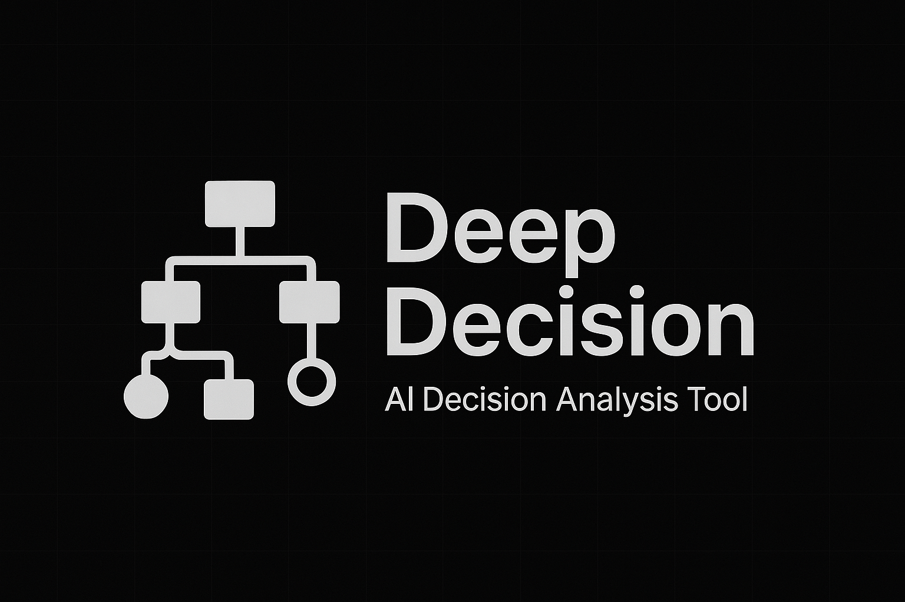

# Deep Decision


一个强大的 AI 深度决策分析工具，通过生成和分析多层次决策树，帮助用户做出复杂决策。

## 开始使用

### 前提条件

- Node.js (v22或更高版本)
- PNPM包管理器

### 安装

```bash
# 克隆仓库
git clone https://github.com/kirklin/deep-decision.git
cd deep-decision

# 安装依赖
pnpm install

# 从示例创建.env.local文件
cp .env.example .env.local
```

### 配置

编辑`.env.local`文件以配置您的AI提供商：

```
# 提供商类型：OPENAI, OLLAMA, 或 AI_SDK
PROVIDER_TYPE=OPENAI

# OpenAI设置（如果使用OPENAI提供商）
OPENAI_API_KEY=your_openai_api_key
OPENAI_MODEL=o3-mini

# Ollama设置（如果使用OLLAMA提供商）
OLLAMA_HOST=http://localhost:11434/api
OLLAMA_MODEL=qwq

# 决策参数
DECISION_DEFAULT_DEPTH=3
DECISION_DEFAULT_BREADTH=4
DECISION_DEFAULT_QUESTIONS=3

# API设置
API_DEFAULT_PORT=3000
```

## 使用方法

### 命令行界面

```bash
# 启动CLI
pnpm start
```

按照提示操作：
1. 输入您的决策问题
2. 设置分析深度和广度
3. 回答跟进问题以提供更多上下文
4. 等待决策分析完成

分析将生成：
- 决策树（保存为JSON）
- 全面的决策报告（保存为Markdown）

### REST API

```bash
# 启动API服务器
pnpm api
```

#### API接口

- `POST /api/feedback-questions`：为决策问题生成跟进问题
- `POST /api/analyze-decision`：使用可自定义参数分析决策
- `GET /api/decision-report`：获取保存的决策报告
- `GET /api/decision-tree`：获取保存的决策树
- `GET /api/model-info`：获取已配置AI模型的信息

## 作者

[Kirk Lin](https://github.com/kirklin)
